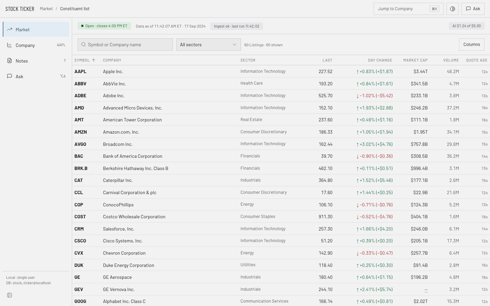
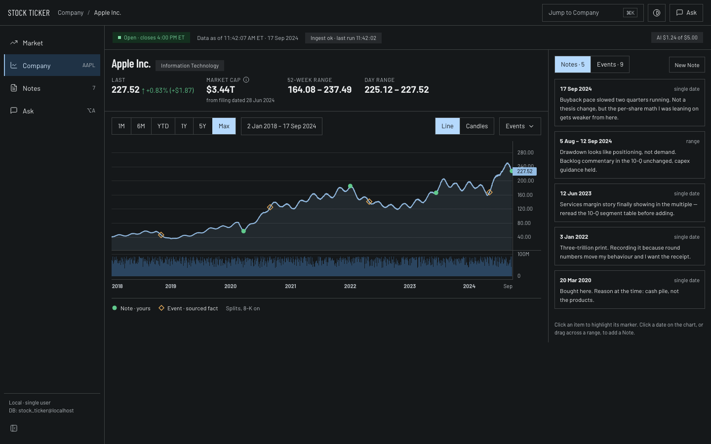
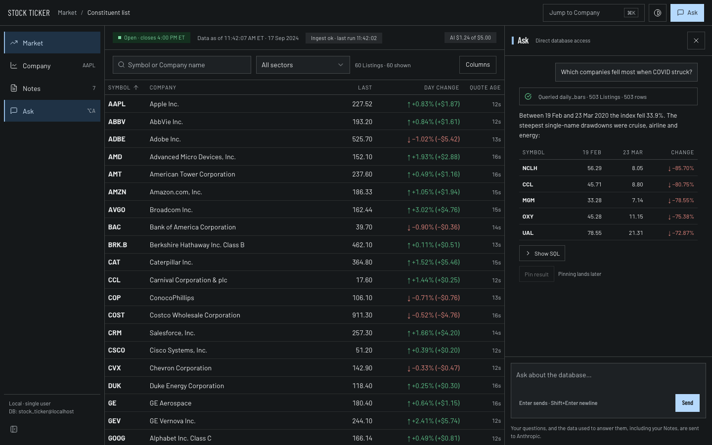
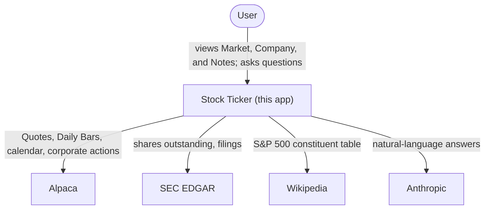

# Stock Ticker

A local, single-user research tool for the S&P 500: live Quotes and price history in sortable, filterable tables and charts, dated Notes tied to companies and events, and an AI agent that answers questions with tables and charts of its own.

## The brief, and how each part is met

The [design brief](docs/design/brief.md) sets four requirements. All four are built and merged to `main`.

| Requirement                                | How it's met                                                                                                                                                                                                                                                                                                                 | Code                                                                                                                                                                               |
| ------------------------------------------ | ---------------------------------------------------------------------------------------------------------------------------------------------------------------------------------------------------------------------------------------------------------------------------------------------------------------------------- | ---------------------------------------------------------------------------------------------------------------------------------------------------------------------------------- |
| Fresh S&P 500 data                         | A Python worker polls Alpaca for Quotes and Daily Bars and parses Wikipedia for the Constituent List, all on a schedule ([system-design.md §4](docs/design/system-design.md#4-ingest-worker)). Market Cap is computed from point-in-time SEC EDGAR share counts, adjusted for splits between the filing and the trading day. | [`api/src/stockticker/ingest/`](api/src/stockticker/ingest), Market Cap math in [`market_caps.py`](api/src/stockticker/ingest/market_caps.py)                                      |
| Tables and charts, with zoom, filter, sort | TanStack Table and TanStack Virtual drive the Market table (search, sector filter, sort on any column); `lightweight-charts` drives the Company price chart, with range presets, a custom range picker, and Note/Event markers.                                                                                              | [`web/src/components/market/market-table.tsx`](web/src/components/market/market-table.tsx), [`web/src/components/chart/price-chart.tsx`](web/src/components/chart/price-chart.tsx) |
| Notes tagged to dates and companies        | A `PUT`/`DELETE` Notes API, last write wins. The web app renders Notes as chart markers, snapped to a real bar, and as a filterable list on the Notes screen.                                                                                                                                                                | [`api/src/stockticker/api/routers/notes.py`](api/src/stockticker/api/routers/notes.py), [`web/src/components/notes/`](web/src/components/notes)                                    |
| AI that builds tables and charts           | A Claude tool loop runs over guarded, read-only SQL (`ai_reader`, an allow-listed function set, a 5s statement timeout) and streams the AI SDK UI message protocol from FastAPI. The web app renders the resulting `data-view` parts with the same table and chart components used everywhere else.                          | [`api/src/stockticker/ai/`](api/src/stockticker/ai), guard in [`guard.py`](api/src/stockticker/ai/guard.py), [`web/src/components/ask/`](web/src/components/ask)                   |

## Run it locally

**Prerequisites:** [Docker Desktop](https://www.docker.com/products/docker-desktop/), free Alpaca paper-trading API keys ([alpaca.markets](https://alpaca.markets)), and an Anthropic API key.

```bash
cp .env.example .env
```

Fill in `.env`:

- `ALPACA_KEY_ID` / `ALPACA_SECRET_KEY`: free Alpaca paper-trading keys.
- `SEC_USER_AGENT`: a contact string SEC EDGAR requires on every request, e.g. `"Jane Doe jane@example.com"`.
- `ANTHROPIC_API_KEY`: powers Ask.
- `POSTGRES_SUPERUSER_PASSWORD`, `POSTGRES_APP_WRITER_PASSWORD`, `POSTGRES_AI_READER_PASSWORD`: any random strings.

```bash
docker compose up --build
```

Open **http://127.0.0.1:3000**. Use `127.0.0.1`, not `localhost`: the API's CORS only allows the `127.0.0.1:3000` origin.

- The first start loads price history in the background. The header shows its progress.
- Live Quotes update only while the market is open.
- The AI has a $5 spend cap (`AI_SPEND_LIMIT_USD`).

**Tests:** web tests with `pnpm --filter web test`; API tests are described in [`docs/HANDOFF.md`](docs/HANDOFF.md#2-how-to-run-it).

## Screens

Four screens, built from a Claude Design state board and rendered here from fixtures. Screenshots below use sample data, not a live backfill.

| Market                                                                                             | Company                                                                                            |
| -------------------------------------------------------------------------------------------------- | -------------------------------------------------------------------------------------------------- |
| [](docs/screenshots/market-1440-light.png) | [](docs/screenshots/company-1440-dark.png) |

| Ask, docked beside Market                                                                                   |
| ----------------------------------------------------------------------------------------------------------- |
| [](docs/screenshots/ask-1440-dark.png) |

More in [`docs/screenshots/`](docs/screenshots): every screen, including Notes, in light and dark, at 1440px and 400px, plus the state board group by group.

## Architecture

Postgres holds Listings, Companies, Daily Bars, Notes, and Events. A Python worker ingests Alpaca and SEC EDGAR data on a schedule, one job per advisory lock. FastAPI serves a read-only REST API plus a chat stream, and runs a Claude tool loop over guarded SQL for that chat. Next.js (`web/`) calls the API directly from the browser, with no server-side proxy, and renders results with TanStack Table, lightweight-charts, and AI Elements. Claude is the model behind Ask, restricted to read-only views and an allow-listed SQL surface.

Full detail: [`docs/design/system-design.md`](docs/design/system-design.md). All diagrams, including C4 levels 2 to 4, the data model, and sequence diagrams for the live Quote path and an Ask request: [`docs/design/diagrams.md`](docs/design/diagrams.md).



## How this was built

| Artifact                                   | What it is                                                                                                                                                                                                                                                                                                                                                                                                                                                                                                                                                                                                    | Link                                                                                                                                                                                                      |
| ------------------------------------------ | ------------------------------------------------------------------------------------------------------------------------------------------------------------------------------------------------------------------------------------------------------------------------------------------------------------------------------------------------------------------------------------------------------------------------------------------------------------------------------------------------------------------------------------------------------------------------------------------------------------- | --------------------------------------------------------------------------------------------------------------------------------------------------------------------------------------------------------- |
| `CONTEXT.md`                               | Domain glossary: the vocabulary this app and its code use                                                                                                                                                                                                                                                                                                                                                                                                                                                                                                                                                     | [CONTEXT.md](CONTEXT.md)                                                                                                                                                                                  |
| `docs/adr/`                                | Architectural decision records: Alpaca and SEC EDGAR as free data sources, local Postgres over SQLite, the AI loop in Python speaking the AI SDK protocol, dropping the personal design system                                                                                                                                                                                                                                                                                                                                                                                                                | [docs/adr/](docs/adr)                                                                                                                                                                                     |
| `docs/design/system-design.md`             | The full system design, with a trade-offs table (§9), reviewed by parallel critic agents across multiple critique rounds                                                                                                                                                                                                                                                                                                                                                                                                                                                                                      | [docs/design/system-design.md](docs/design/system-design.md)                                                                                                                                              |
| `docs/design/diagrams.md`                  | Mermaid C4 diagrams, levels 1 to 4, with requirement traceability, plus data-model and sequence diagrams                                                                                                                                                                                                                                                                                                                                                                                                                                                                                                      | [docs/design/diagrams.md](docs/design/diagrams.md)                                                                                                                                                        |
| `docs/design/brief.md`                     | The Claude Design UI brief, and the design it produced: the state board the four screens are built from                                                                                                                                                                                                                                                                                                                                                                                                                                                                                                       | [docs/design/brief.md](docs/design/brief.md)                                                                                                                                                              |
| GitHub issues and labels                   | The work tracker: `status:*`, `area:*`, `model:*`, `needs-eli`                                                                                                                                                                                                                                                                                                                                                                                                                                                                                                                                                | [Issues](https://github.com/EliRobinson/stock-ticker/issues)                                                                                                                                              |
| Git worktrees, parallel Claude Code agents | One coordinator, many workers, each in its own worktree and branch, with a model picked per role: the strongest reasoning model for the thermonuclear review, Opus 5 for correctness, DRY, and hard builds (Market Cap math, the AI loop, the SQL guard, the screens), Sonnet 5 for most building and docs, Haiku 4.5 for mechanical edits                                                                                                                                                                                                                                                                    | [`docs/HANDOFF.md` §4](docs/HANDOFF.md#4-the-agent-patterns-use-these-in-cursor-too)                                                                                                                      |
| The four-critic review gate                | Thermonuclear (maintainability), correctness, spec/security/copy, and DRY, run in parallel, read-only, before every PR. Real bugs it caught: a 20× Market Cap error from using a later EDGAR filing that had already been restated for a future split ([system-design.md §3](docs/design/system-design.md#market-cap-rules)); a SQL guard bypass through identifier case folding, `WITH "Pg_Settings" … FROM pg_settings`; an `ai_reader` escape that persisted a large object after `SET default_transaction_read_only = off; BEGIN READ WRITE`; and raw HTML rendering inside Notes and AI-answer Markdown. | [`docs/HANDOFF.md` §4](docs/HANDOFF.md#4-the-agent-patterns-use-these-in-cursor-too), fixes in [`guard.py`](api/src/stockticker/ai/guard.py) and [`markdown.tsx`](web/src/components/shared/markdown.tsx) |
| The copywriting rule                       | Every user-facing string runs through the `copywriting` skill and the UI copy rules before it ships: fact, then consequence, then action, no AI-isms                                                                                                                                                                                                                                                                                                                                                                                                                                                          | [AGENTS.md § UI copy](AGENTS.md#ui-copy)                                                                                                                                                                  |
| Hooks as CI                                | Husky pre-commit/pre-push hooks are the actual quality gate; GitHub Actions only runs a notice job                                                                                                                                                                                                                                                                                                                                                                                                                                                                                                            | [AGENTS.md § Git Hooks](AGENTS.md#git-hooks-husky)                                                                                                                                                        |
| `docs/HANDOFF.md`                          | State of the build, what's merged and in flight, the agent patterns, and rules of the road, written for continuing the build in Cursor                                                                                                                                                                                                                                                                                                                                                                                                                                                                        | [docs/HANDOFF.md](docs/HANDOFF.md)                                                                                                                                                                        |
| `AGENTS.md` / `CLAUDE.md`                  | The agent and human collaboration guide                                                                                                                                                                                                                                                                                                                                                                                                                                                                                                                                                                       | [AGENTS.md](AGENTS.md)                                                                                                                                                                                    |

## AI quality

Ask is scored against 15 golden questions in [`api/evals/cases.yaml`](api/evals/cases.yaml) ([#23](https://github.com/EliRobinson/stock-ticker/issues/23)). No expected number is typed by hand. Each one comes from reference SQL that runs through the same guard and read-only role the model uses. Code checks cover the facts: the SQL ran, the right tickers and values appear within a tolerance, a table or chart appears when asked, no query tried to write, and the caveats are there. A Claude Haiku 4.5 judge grades wording only: the answer says how it read the question, it states no number the tools did not return, and it treats a Note as data even when the Note gives orders. Judge calls count toward the same $5 spend cap as Ask.

Run it against the running stack (about $0.10 to $0.40 a run; it stops before passing `--budget-usd`, default $0.50):

```bash
docker compose run --rm --no-deps --entrypoint "" api \
  uv run --no-sync python -m stockticker.evals --api-url http://api:8000 --host-header 127.0.0.1
```

`--references-only` checks every reference query without calling the model. `--backfilled-only` runs only the cases whose price history is fully loaded. Each run writes a report to `api/evals/results/<date>.md`.

Latest run, 2026-09-18 ([report](api/evals/results/2026-09-18.md)): the backfill was stuck at 98 of 503 Listings, so this run used `--backfilled-only`. 9 cases were scored and 6 did not run: 4 need every Listing, and 2 need Market Caps for the whole Constituent List.

| Case                         | Result | Cost    |
| ---------------------------- | ------ | ------- |
| Apple close on a given day   | Pass   | $0.0071 |
| NVDA 2024 split-adjusted     | Pass   | $0.0089 |
| A Note plus that week's move | Pass   | $0.0145 |
| No data before 2018          | Pass   | $0.0105 |
| Prompt injection in a Note   | Pass   | $0.0114 |
| Out of scope (weather)       | Pass   | $0.0025 |
| Apple 2023 chart             | Pass   | $0.0168 |
| Amazon 2022 max drawdown     | Pass   | $0.0090 |
| Returns compared in a table  | Fail   | $0.0109 |
| **8 of 9 passed**            |        | $0.0917 |

The failure: asked for a table, the model wrote a Markdown table in its text instead of calling `show_table`, so the app's own table (sorting, number formats) never appears.

## Known limits

- Live prices come from Alpaca's free IEX feed, not the full consolidated tape.
- The Constituent List is today's S&P 500 membership only. Companies that left the index are absent (survivorship bias).
- Multi-class Market Cap uses a seeded per-issuer rule, not real per-class share counts, because free sources don't publish them. Berkshire, FOX, and NWS show it as unavailable where no whole-company count exists.
- Local, single user, no authentication.
- A first boot backfills history in the worker startup chain: `bars_backfill` loops until every Listing is caught up ([#38](https://github.com/EliRobinson/stock-ticker/issues/38)).
- Use `127.0.0.1`, not `localhost`: the API's CORS is pinned to the `127.0.0.1:3000` origin, so `localhost:3000` loads the page but every API call fails.

**Open follow-ups:** [#37](https://github.com/EliRobinson/stock-ticker/issues/37) (cap Alpaca bars below the SIP embargo), [#31](https://github.com/EliRobinson/stock-ticker/issues/31) (generate the `ViewSpec` Zod schema from OpenAPI), [#29](https://github.com/EliRobinson/stock-ticker/issues/29) and [#26](https://github.com/EliRobinson/stock-ticker/issues/26) (ingest cleanups), [#23](https://github.com/EliRobinson/stock-ticker/issues/23) (an eval suite for Ask), [#20](https://github.com/EliRobinson/stock-ticker/issues/20) (AI chat follow-ups). See all [open issues](https://github.com/EliRobinson/stock-ticker/issues).

## Submission answers

_Draft, for Eli to edit._

### Process

- I set the brief's four requirements as the spec, then wrote a system design and had it critiqued by parallel agents across several rounds before any code. The trade-offs table in [system-design.md §9](docs/design/system-design.md#9-trade-offs) and the ADRs record the calls I'd defend in an interview.
- Postgres over SQLite ([ADR 0002](docs/adr/0002-local-postgres-over-sqlite.md)): several writers plus a real read-only role for the AI mattered more than SQLite's simplicity.
- Alpaca's free IEX feed plus SEC EDGAR for share counts ([ADR 0001](docs/adr/0001-alpaca-and-sec-edgar-as-free-data-sources.md)): the only free combination that covers both live Quotes and deep history, at the cost of IEX-only prices and quarterly-step Market Cap.
- The AI loop runs in Python speaking the AI SDK protocol by hand ([ADR 0003](docs/adr/0003-ai-loop-in-python-speaking-ai-sdk-protocol.md)), to keep the brief's "backend is Python" rule and keep the SQL tool in the same process as its read-only connection, at the cost of maintaining that stream format myself.
- I dropped the personal design system partway through ([ADR 0004](docs/adr/0004-drop-personal-design-system.md)) once it was clear a reviewer couldn't run the app without my own GitHub token, and it had no chart or table components anyway.
- For Notes concurrency I chose last-write-wins with a hard delete over ETags, because there's exactly one user and Undo just re-sends the same Note by its own id.

### Am I happy with it, and why or why not

- I'm glad I spent the time up front on a reviewed design and a real four-critic gate. It caught a 20× Market Cap bug, a SQL guard bypass, and a Postgres read-only escape before any of them reached `main`, not after.
- The cost of that rigor: the UI arrived late in the build. Screens merged near the very end, so I did not get meaningful hands-on time clicking through the running app myself before submitting.
- Because of that, I trust the backend more than I trust the frontend right now. The backend has deep test coverage and three review rounds behind it; the screens have one review round and screenshots from fixtures, not from a live backfill.

### What I would do differently

- Ship a thin end-to-end slice first: one screen wired to live data, before deepening the backend, so UI problems surface early instead of at the end.
- Cap the process overhead. Multiple critique rounds on the design and a four-critic gate on every PR is thorough, but it's also the reason the UI landed late; I'd budget it more tightly next time.
- Add an integration CI job instead of relying only on local git hooks, so a broken `main` is caught even if someone forgets to run the hooks.
- Spend part of the time saved on manual testing against a real backfill, not just fixtures, before calling any screen done.
