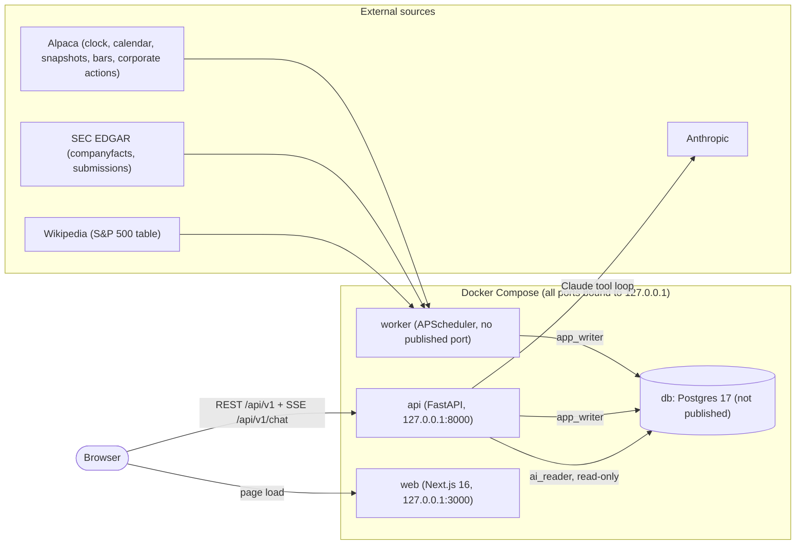
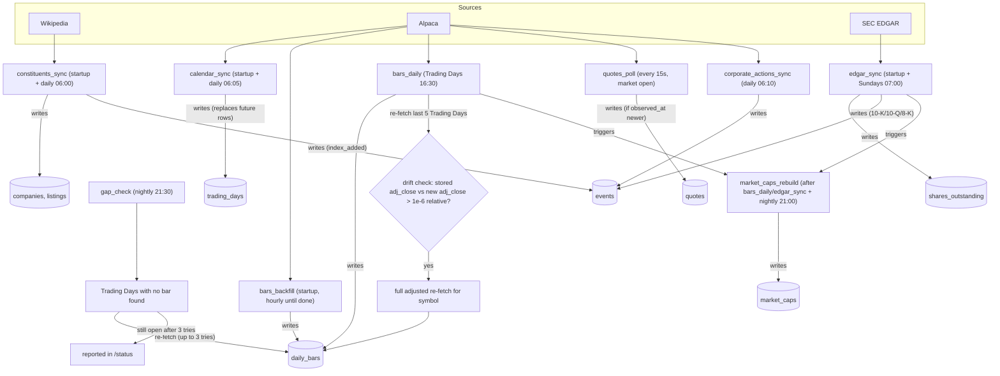
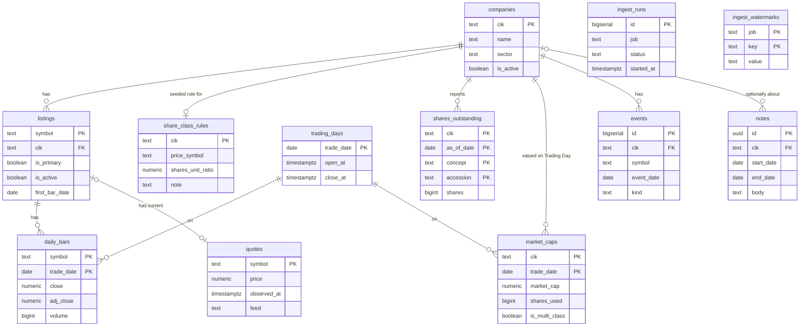
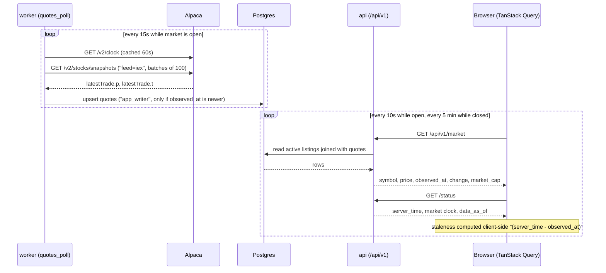
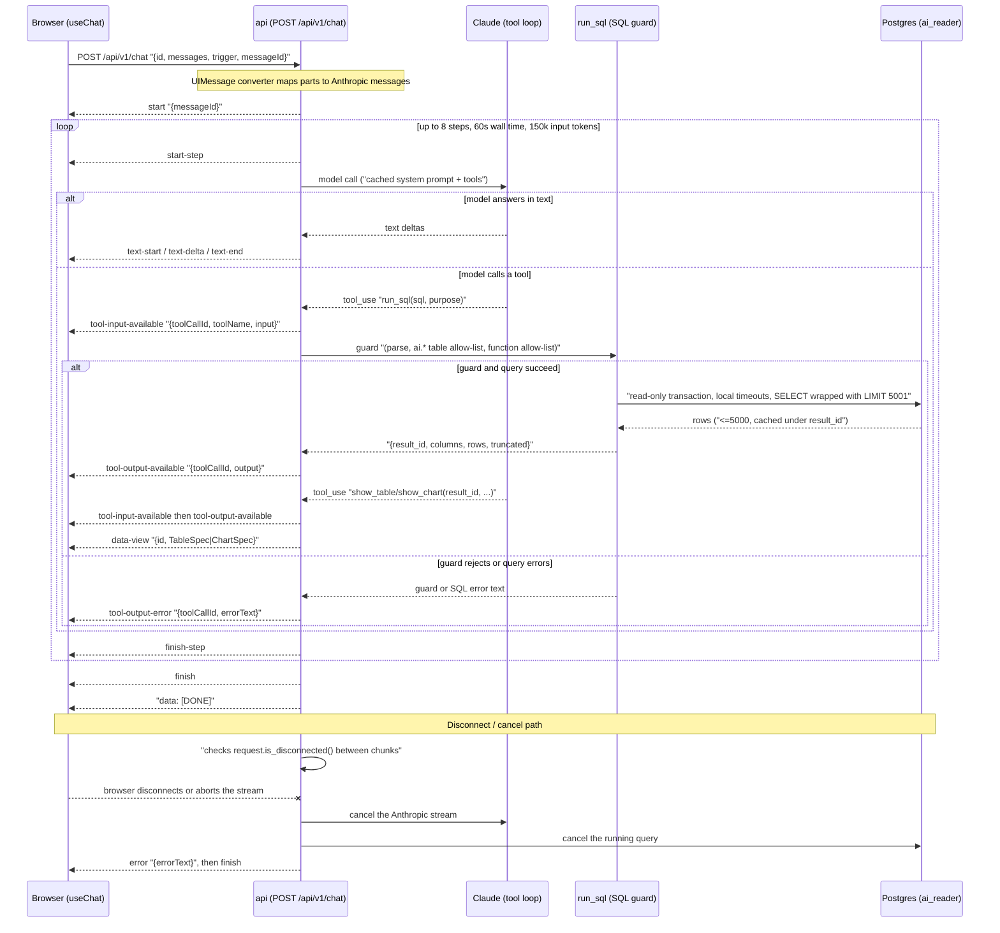
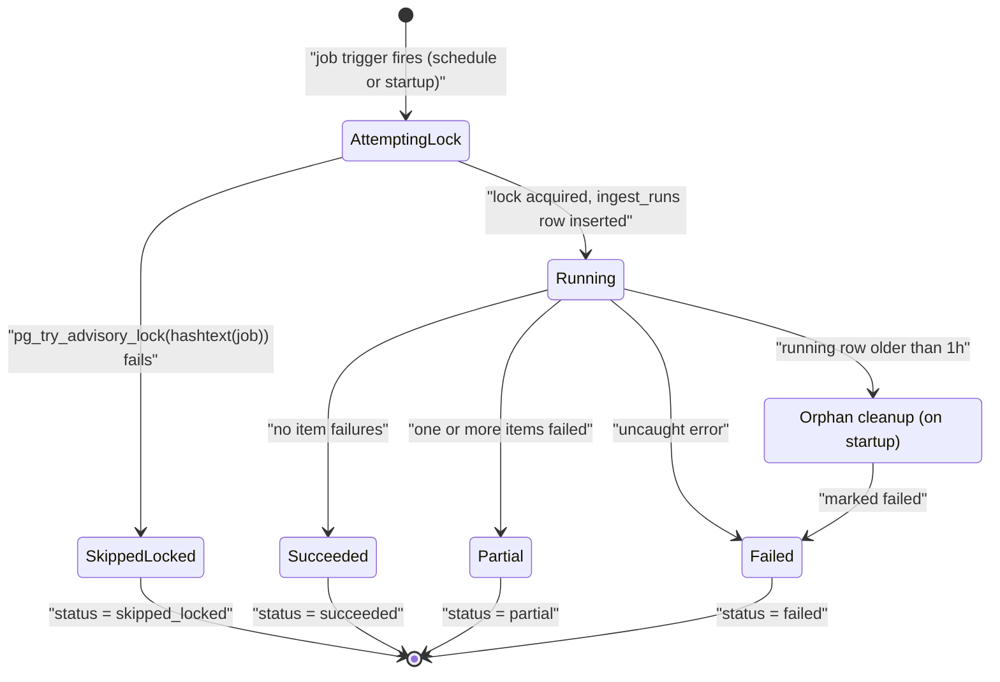

# System Design Diagrams

Mermaid renderings of the design in [system-design.md](system-design.md), using the terms defined in [CONTEXT.md](../../CONTEXT.md).

## 1. System context and containers

Look at which external source feeds which compose service, and which Postgres role (`app_writer` or `ai_reader`) each edge into `db` uses. Every compose port binds to `127.0.0.1`; `db` is not published at all.

## 2. Ingest schedule and data flow

Look at which job writes which tables, and the three trigger chains: `bars_daily`'s drift check queuing a full adjusted re-fetch, `bars_daily`/`edgar_sync` both triggering `market_caps_rebuild`, and `gap_check` queuing its own re-fetch.

## 3. Data model

Look at the primary keys (composite where the design calls for one, such as `daily_bars` and `market_caps`), the foreign keys, and which tables sit outside the relationship graph entirely (`ingest_runs`, `ingest_watermarks` are job bookkeeping, not domain data).

## 4. Live Quote path

Look at the two independent loops: the worker polling Alpaca every 15 seconds and upserting only newer Quotes, and the browser polling `/api/v1/market` every 10 seconds and computing staleness itself from `observed_at` against `/status`'s `server_time`.

## 5. Ask (AI) request

Look at the tool loop's inner `alt` (text versus a tool call), the SQL guard sitting between the model's `run_sql` call and `ai_reader`, and the disconnect path at the bottom where the API cancels both the model stream and the running query.

## 6. Job run lifecycle

Look at the fork right after the advisory lock (`skipped_locked` versus `running`), the three terminal outcomes of a running job, and the separate orphan-cleanup path that fails any `running` row still open after an hour.

