# System Design Diagrams

Mermaid renderings of the design in [system-design.md](system-design.md), using the terms defined in [CONTEXT.md](../../CONTEXT.md).

## Requirements traceability

The four requirements from the design brief, the diagrams that show each one, the main components involved, and the tracking issues.

| Requirement                                                           | Diagrams                                                                                                                                                                                                                                                                                       | Main components                                                                                                                                                                                                                                                             | GitHub issues                                                                                                                                                                      |
| --------------------------------------------------------------------- | ---------------------------------------------------------------------------------------------------------------------------------------------------------------------------------------------------------------------------------------------------------------------------------------------- | --------------------------------------------------------------------------------------------------------------------------------------------------------------------------------------------------------------------------------------------------------------------------- | ---------------------------------------------------------------------------------------------------------------------------------------------------------------------------------- |
| **R1**: S&P 500 price data kept as fresh as possible                  | [2](#2-containers-c4-level-2), [3 (worker)](#component-worker), [4 (R1)](#code-r1-fresh-sp-500-price-data), [5](#5-ingest-sources-and-the-startup-chain-not-a-c4-diagram), [6](#6-ingest-jobs-tables-and-triggers-not-a-c4-diagram), [8](#8-live-quote-path-sequence-diagram-not-a-c4-diagram) | `worker`, `QuoteSource`/`BarSource`, the Alpaca adapter (planned), `JobSpec`/`JobContext`/`run_job`, `upsert_quotes`/`upsert_bars`, `quotes_poll`, `bars_backfill`, `bars_daily`, `constituents_sync`, `calendar_sync`, `corporate_actions_sync`, `edgar_sync`, `gap_check` | [#4](https://github.com/EliRobinson/stock-ticker/issues/4), [#5](https://github.com/EliRobinson/stock-ticker/issues/5)                                                             |
| **R2**: tables and charts with data manipulation (zoom, filter, sort) | [3 (api, web)](#3-components-c4-level-3), [4 (R2)](#code-r2-tables-and-charts-with-data-manipulation), [7](#7-data-model-er-diagram-not-a-c4-diagram)                                                                                                                                          | `market`/`bars`/`companies` routers, `MarketRow`/`Bar` models, `useMarket`/`useBars`, the market-table lib, the chart-data lib, `market_caps_rebuild`                                                                                                                       | [#6](https://github.com/EliRobinson/stock-ticker/issues/6), [#8](https://github.com/EliRobinson/stock-ticker/issues/8), [#9](https://github.com/EliRobinson/stock-ticker/issues/9) |
| **R3**: notes tagged to dates or companies                            | [3 (api, web)](#3-components-c4-level-3), [4 (R3)](#code-r3-notes-tagged-to-dates-or-companies)                                                                                                                                                                                                | `notes` router, `Note`/`NoteCreate`/`NoteUpdate` models, `usePutNote`, chart marker snapping                                                                                                                                                                                | [#6](https://github.com/EliRobinson/stock-ticker/issues/6), [#9](https://github.com/EliRobinson/stock-ticker/issues/9)                                                             |
| **R4**: AI that builds and interacts with tables and charts           | [3 (api, web)](#3-components-c4-level-3), [4 (R4)](#code-r4-ai-that-builds-and-interacts-with-tables-and-charts), [9](#9-ask-ai-request-sequence-diagram-not-a-c4-diagram)                                                                                                                     | `chat` router, `ai.tools`/`ai.guard`/`ai.executor`/`ai.stream`/`ai.spend`, `ViewSpec`, the `useChat` transport                                                                                                                                                              | [#7](https://github.com/EliRobinson/stock-ticker/issues/7), [#8](https://github.com/EliRobinson/stock-ticker/issues/8), [#9](https://github.com/EliRobinson/stock-ticker/issues/9) |

## 1. System context (C4 Level 1)

Look at who the app talks to and why: the user drives it, and it reaches out to four external systems. This is the widest zoom; nothing about compose services or Postgres roles appears here.

## 2. Containers (C4 Level 2)

One level in from the context diagram: the four compose services inside the loopback trust boundary, the Postgres roles on each edge into `db`, the `ai` schema sitting between `ai_reader` and the tables, the `migrate` service that both `api` and `worker` wait on, and the one edge where data (Notes and query rows) leaves the machine for Anthropic.

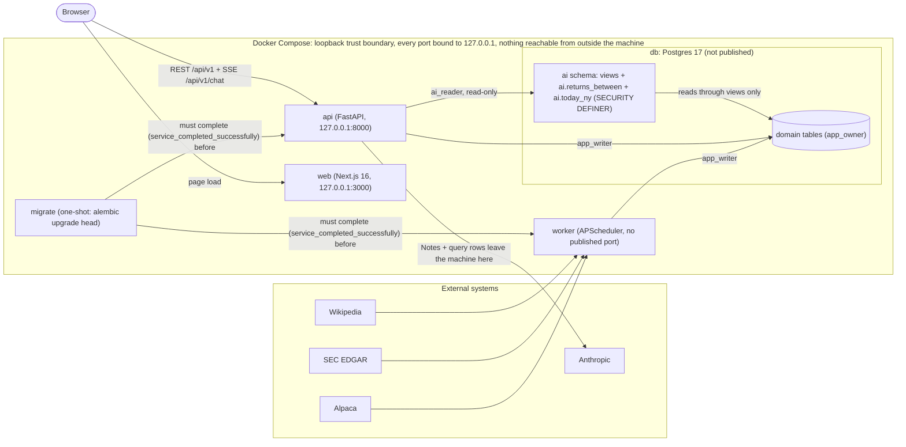

## 3. Components (C4 Level 3)

One diagram per container, one level in from diagram 2. Each component is tagged with the requirement(s) it serves. Mermaid's native `C4Component` diagram type renders poorly on GitHub, so these use `flowchart` with subgraphs instead, checked to render cleanly with mermaid-cli.

Reflects [`feat/api-foundation`](https://github.com/EliRobinson/stock-ticker/tree/feat/api-foundation) @ `9436289fdc` for the `api` diagram, the same commit plus [`feat/ingest-reference`](https://github.com/EliRobinson/stock-ticker/tree/feat/ingest-reference) @ `9b5c63fe57` for the `worker` diagram, and the same commit plus [`feat/web-data`](https://github.com/EliRobinson/stock-ticker/tree/feat/web-data) @ `913e9decc0` for the hooks and lib layers of the `web` diagram. Its screens, containers, and shell have no branch yet (`feat/web-screens` doesn't exist), so those are drawn from the plan the #9 builder shared directly.

### Component: api

The `api` container: its HTTP routers, the AI module behind `POST /api/v1/chat`, and the two Postgres roles it connects as. Most routers below are still `501` stubs on `feat/api-foundation` (only `health` and `status` have real bodies), so this diagram is the shape the container is built around, not a claim that every edge already moves real data.

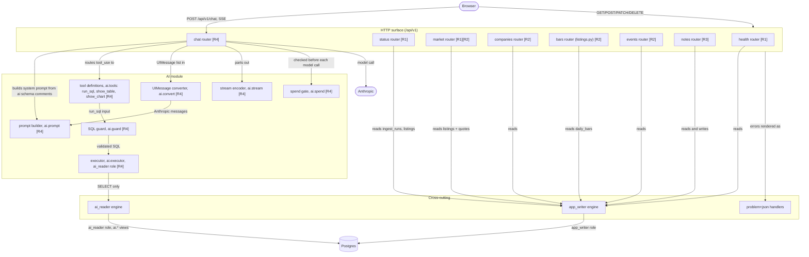

### Component: worker

The `worker` container: the job registry and lifecycle, the source adapters, the sinks that write to Postgres, and the jobs that tie them together. The Alpaca adapters are drawn from spec: no `feat/ingest-alpaca` branch exists yet, only the `QuoteSource`/`BarSource` protocols they will implement.

```mermaid
flowchart TD
    subgraph registry["Job registry and lifecycle"]
        jobs["JOBS registry [R1]"]
        jobwrap["job wrapper: run_job [R1]"]
        startup["startup chain: run_startup_chain [R1]"]
        scheduler["scheduler, AsyncIOScheduler [R1]"]
    end

    subgraph adapters["Adapters"]
        alpacaq["Alpaca QuoteSource [R1]"]
        alpacab["Alpaca BarSource [R1]"]
        edgar["EDGAR adapter [R1]"]
        wiki["Wikipedia adapter [R1]"]
    end

    subgraph sinks["Sinks"]
        upq["upsert_quotes [R1]"]
        upb["upsert_bars [R1]"]
    end

    subgraph jobsg["Jobs"]
        cs["constituents_sync [R1]"]
        cal["calendar_sync [R1]"]
        bb["bars_backfill [R1]"]
        bd["bars_daily [R1]"]
        qp["quotes_poll [R1]"]
        cas["corporate_actions_sync [R1]"]
        es["edgar_sync [R1]"]
        mcr["market_caps_rebuild [R1][R2]"]
        gc["gap_check [R1]"]
        prune["ingest_runs_prune"]
    end

    alpacaSrc(["Alpaca"])
    edgarSrc(["SEC EDGAR"])
    wikiSrc(["Wikipedia"])
    pg[("Postgres, app_writer")]

    wiki -->|"parses S&P 500 table"| cs
    edgar -->|"companyfacts, submissions"| es
    alpacaq -->|"snapshot symbols"| qp
    alpacab -->|"daily_bars raw and all"| bb
    alpacab -->|"daily_bars last 5 days"| bd

    wiki -->|"HTTP GET"| wikiSrc
    edgar -->|"HTTP GET, 5 req per s"| edgarSrc
    alpacaq -->|"HTTP GET"| alpacaSrc
    alpacab -->|"HTTP GET"| alpacaSrc

    qp -->|"ProviderQuote list"| upq
    bb -->|"ProviderBar list"| upb
    bd -->|"ProviderBar list"| upb

    upq -->|"upsert if newer"| pg
    upb -->|"upsert on conflict"| pg
    cs -->|"upsert companies, listings"| pg
    cal -->|"replace future rows"| pg
    cas -->|"upsert events"| pg
    es -->|"upsert shares_outstanding, events"| pg
    mcr -->|"upsert market_caps"| pg
    gc -->|"insert refetch_requests"| pg
    prune -->|"delete old rows"| pg

    jobs -->|"one JobSpec per job"| jobsg
    jobwrap -->|"advisory lock, ingest_runs row"| jobsg
    startup -->|"runs once at boot"| jobsg
    scheduler -->|"cron or interval trigger"| jobsg
```

`constituents_sync`, `edgar_sync`, `market_caps_rebuild`, and `gap_check` are real, on `feat/ingest-reference`. That branch was built against an earlier revision of the job framework (plain `AsyncConnection` handlers registered with a `register()` call) and will need a small rebase onto `feat/api-foundation`'s current `JobContext`/`registry.JOBS` shape when it merges. `calendar_sync`, `bars_backfill`, `bars_daily`, `quotes_poll`, and `corporate_actions_sync` have no branch yet and are drawn from spec (system-design.md §4).

### Component: web

The `web` container: the shell, the four screens and their containers (all still planned, no `feat/web-screens` branch), and the TanStack Query hooks plus the `lib/` layer, which are real on `feat/web-data`. The `lib/api.ts` client is written against the target contract (an idempotent `PUT /api/v1/notes/{id}`, cursor pagination) rather than the `501` stubs currently on `feat/api-foundation`, by design: see the R3 code diagram below.

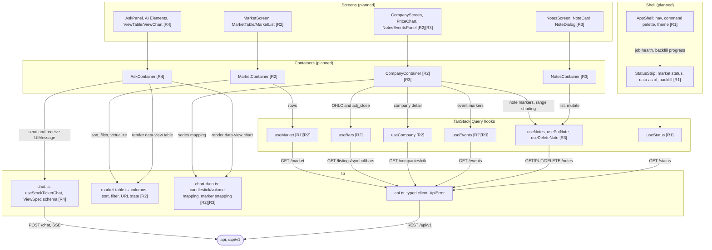

## 4. Code (C4 Level 4)

One `classDiagram` per requirement, showing the key types and functions that implement it. Each diagram names the branch and commit it reflects; where the code doesn't exist yet, the classes are marked `from spec` or `planned` and the diagram is drawn from `system-design.md` or from what the owning builder shared directly.

### Code: R1, fresh S&P 500 price data

Real code from [`feat/api-foundation`](https://github.com/EliRobinson/stock-ticker/tree/feat/api-foundation) @ `9436289fdc`: the `QuoteSource`/`BarSource` protocols, `JobSpec`/`JobContext`/`run_job`, and `upsert_quotes`/`upsert_bars`. `AlpacaQuoteSource`/`AlpacaBarSource` have no branch yet (`feat/ingest-alpaca` doesn't exist) and are drawn from spec (system-design.md §4) as the two classes that will implement the existing protocols.

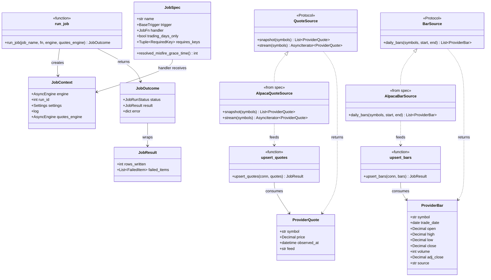

### Code: R2, tables and charts with data manipulation

`MarketRow`, `MarketResponse`, and `Bar` are real Pydantic models from [`feat/api-foundation`](https://github.com/EliRobinson/stock-ticker/tree/feat/api-foundation) @ `9436289fdc`. `ShareCount`, `Split`, `Rejection`, `CompanyRebuild`, `validate_counts`, and `rebuild_company` are real, from [`feat/ingest-reference`](https://github.com/EliRobinson/stock-ticker/tree/feat/ingest-reference) @ `9b5c63fe57` (`market_caps.py`). `marketTableColumns`, `MarketFilterState`, `useMarket`, `useBars`, `mapBarsToCandlestickSeries`, and `mapBarsToVolumeSeries` are also real, from [`feat/web-data`](https://github.com/EliRobinson/stock-ticker/tree/feat/web-data) @ `913e9decc0`.

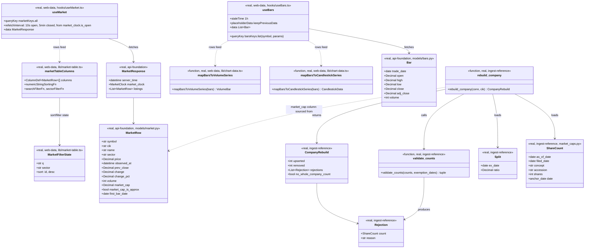

### Code: R3, notes tagged to dates or companies

`Note` is a real Pydantic model on [`feat/api-foundation`](https://github.com/EliRobinson/stock-ticker/tree/feat/api-foundation) @ `9436289fdc`, but that commit's `notes` router has only `POST`, `PATCH`, and `DELETE` handlers, all still `501` stubs: no `PUT /notes/{id}` route exists server-side yet. `PutNoteBody`, `putNote`, `createNoteId`, `usePutNote`, `notesKeys`, `upsertNoteInPages`, `mapNotesToMarkers`, `snapToLoadedBar`, and `ChartMarker` are all real, from [`feat/web-data`](https://github.com/EliRobinson/stock-ticker/tree/feat/web-data) @ `913e9decc0`. The web client is written against the target contract (system-design.md §5's idempotent `PUT`) ahead of the API route existing, by design (`lib/api.ts`'s own comment says so), so calling it today 501s until the API side ships.

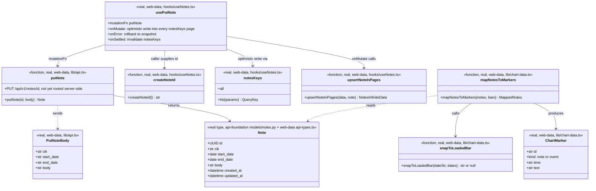

### Code: R4, AI that builds and interacts with tables and charts

`TableColumn`, `TableSpec`, `ChartSeries`, `TimeseriesChartSpec`, and `ViewSpec` are real, from [`feat/api-foundation`](https://github.com/EliRobinson/stock-ticker/tree/feat/api-foundation) @ `9436289fdc` (`models/views.py`). `chat.py` on that commit is a `501` stub, and no `feat/ai-chat` branch exists yet. Everything else here is `planned`, using the class and module names (`ai.tools`, `ai.guard`, `ai.executor`, `ai.stream`, `ai.spend`) the #7 builder shared directly ahead of that branch being pushed, not a guess from system-design.md §6 alone.

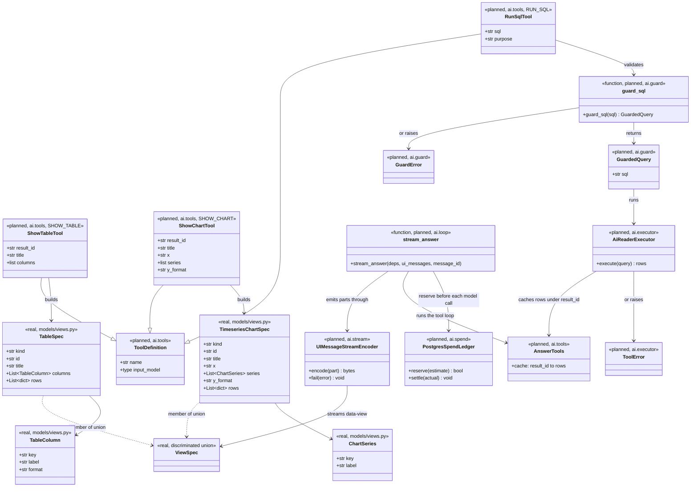

## 5. Ingest: sources and the startup chain (not a C4 diagram)

Look at which external source feeds which job on its regular schedule (thin arrows), and separately, the thick arrows tracing the worker's one-time startup chain: `constituents_sync` then `calendar_sync`, then `bars_backfill` and `edgar_sync` in parallel, then `market_caps_rebuild`, before the regular schedule registers.

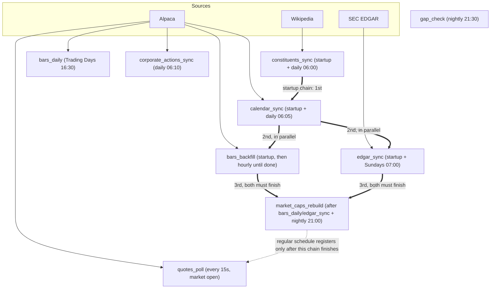

## 6. Ingest: jobs, tables, and triggers (not a C4 diagram)

Look at the `backfill_completed_at` gate (a Listing must clear `bars_backfill` before `bars_daily` or `gap_check` will touch it), the `refetch_requests` table standing in for the old in-memory queue for both the drift check and gap retries, and the `rerun_requested` loop on `market_caps_rebuild`.

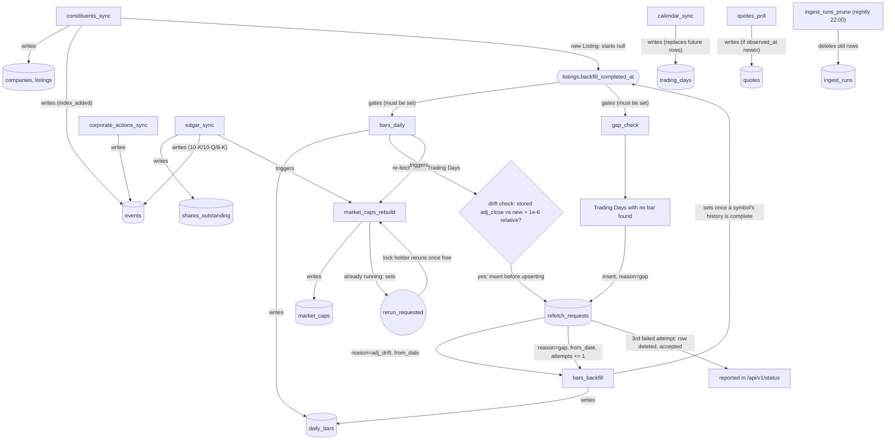

## 7. Data model (ER diagram, not a C4 diagram)

Look at the primary keys, the writer noted in each entity's name (`worker`, `api`, or the checked-in `share_class_rules` seed), the `listings`-`quotes` relationship (exactly one Listing per Quote, zero-or-one Quote per Listing), and the two additions: `refetch_requests` and `share_class_rules.price_symbol`'s link to `listings`.

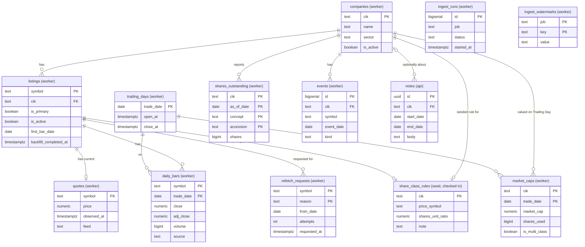

## 8. Live Quote path (sequence diagram, not a C4 diagram)

Look at the two independent loops: the worker polling Alpaca every 15 seconds and upserting only newer Quotes, and the browser polling `/api/v1/market` every 10 seconds. Staleness now comes from that single response, with no second call to `/api/v1/status`.

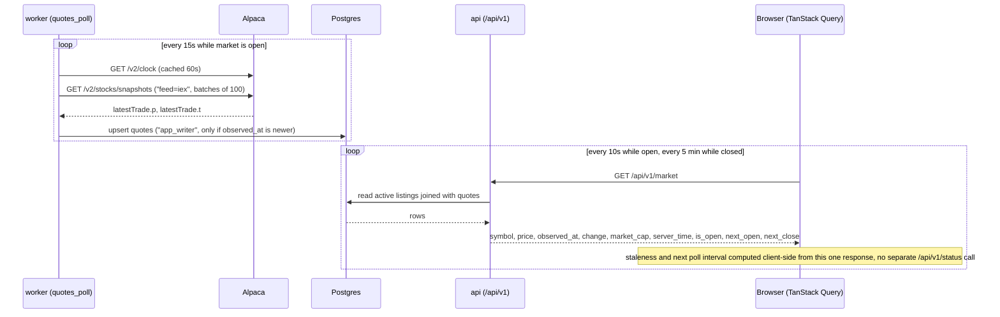

## 9. Ask (AI) request (sequence diagram, not a C4 diagram)

Look at the two-step split: `run_sql` finishes a step before `show_table`/`show_chart` can read its `result_id` on the next model call. The bottom `alt` is the only top-level branch: normal completion, a mid-stream error that closes every open part first, or a client disconnect that cancels both the model stream and the query and sends nothing more.

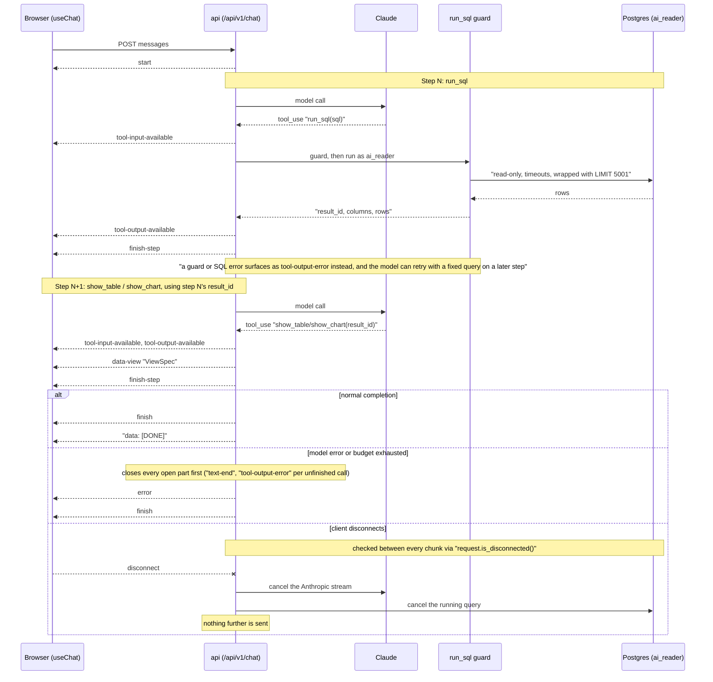

## 10. Job run lifecycle (state diagram, not a C4 diagram)

Look at the fork right after the trigger (`skipped_locked`, `skipped`, or `running`), the `rerun_requested` loop back into `Running` when a locked job is retriggered, the "lock connection lost" path straight to `failed`, and orphan cleanup, which now fires at any age, not just at startup.

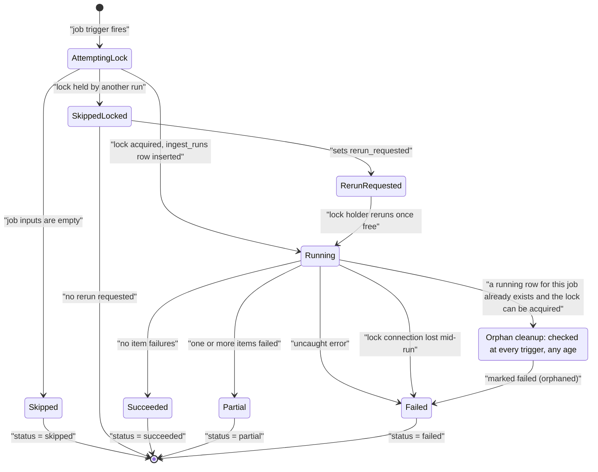

## 11. Startup order (not a C4 diagram)

Look at the join before `web`: both `api` becoming ready and the worker's own startup chain (diagram 5) have to finish, not just `migrate`.

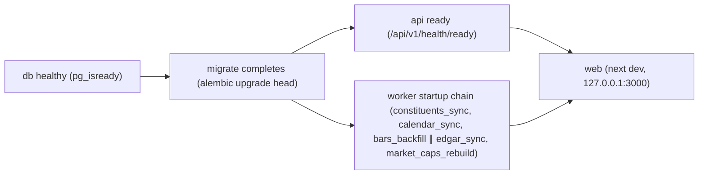
