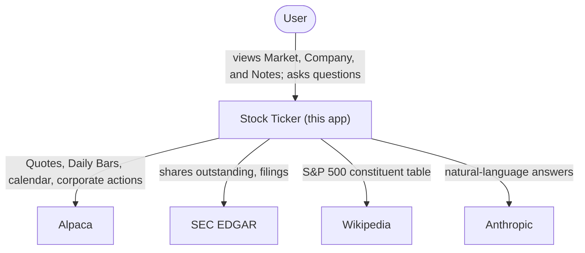
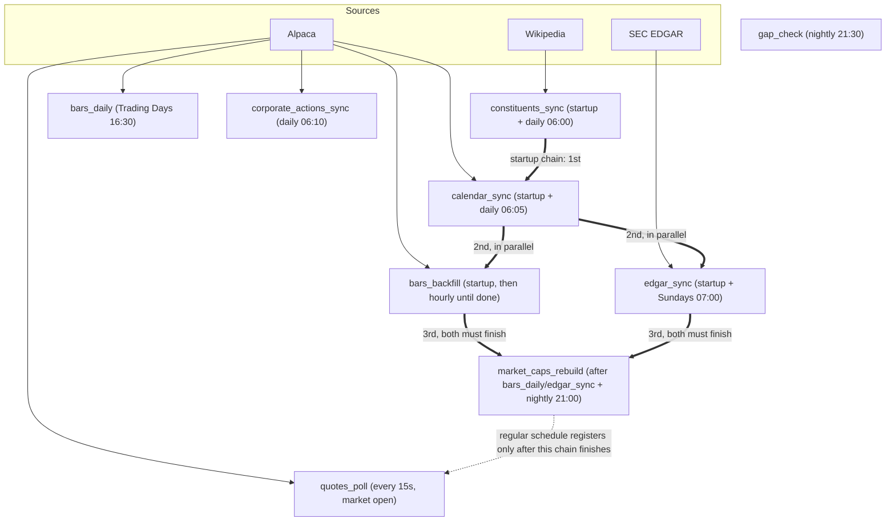
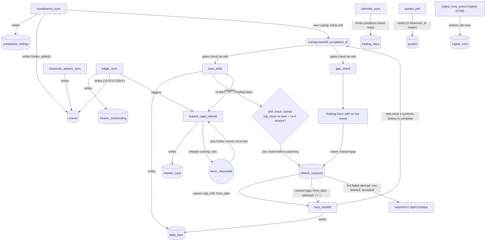
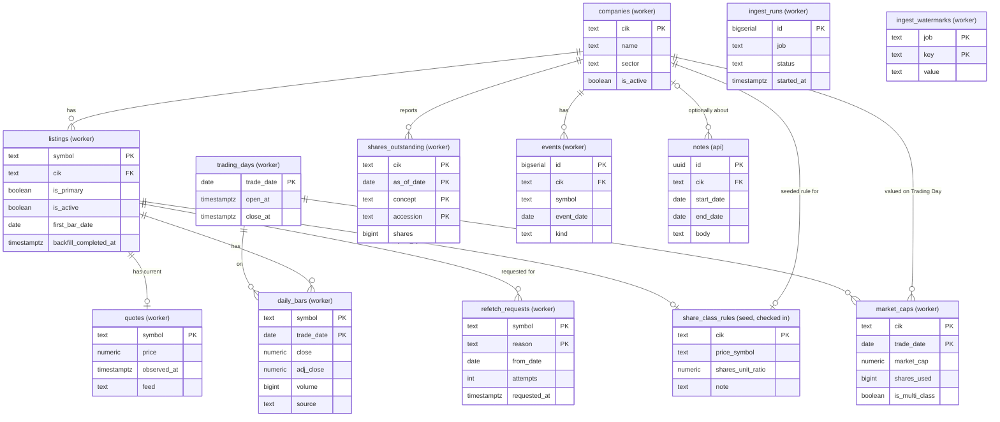
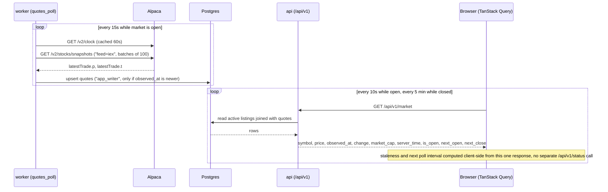
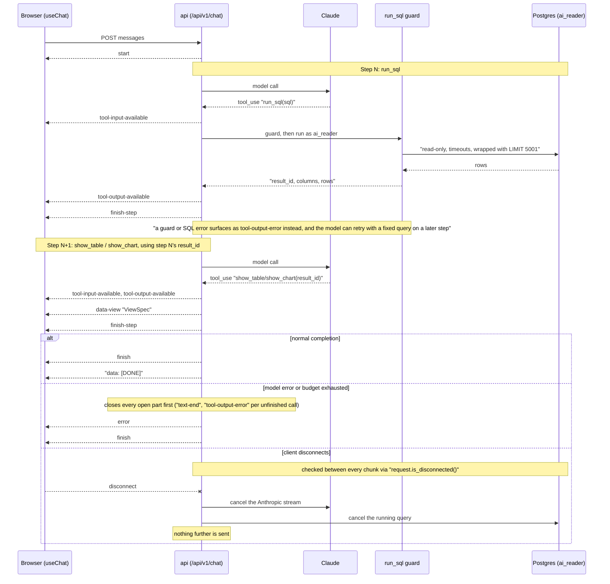
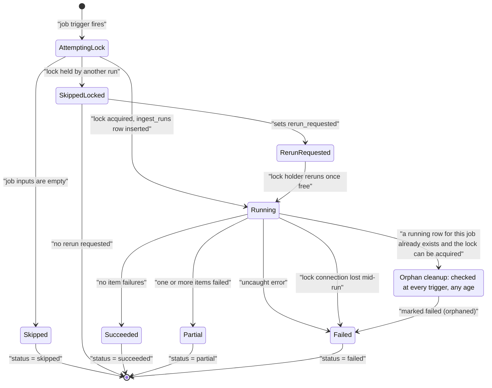
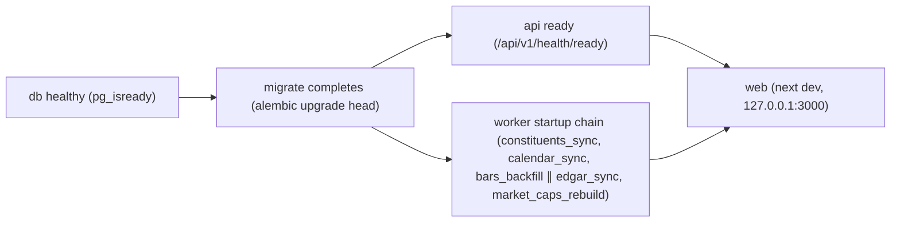

# System Design Diagrams

Mermaid renderings of the design in [system-design.md](system-design.md), using the terms defined in [CONTEXT.md](../../CONTEXT.md).

## 1. System context (C4 Level 1)

Look at who the app talks to and why: the user drives it, and it reaches out to four external systems. This is the widest zoom; nothing about compose services or Postgres roles appears here.

## 2. Containers (C4 Level 2)

One level in from the context diagram: the four compose services inside the loopback trust boundary, the Postgres roles on each edge into `db`, the `ai` schema sitting between `ai_reader` and the tables, the `migrate` service that both `api` and `worker` wait on, and the one edge where data (Notes and query rows) leaves the machine for Anthropic.

## 3. Ingest: sources and the startup chain (not a C4 diagram)

Look at which external source feeds which job on its regular schedule (thin arrows), and separately, the thick arrows tracing the worker's one-time startup chain: `constituents_sync` then `calendar_sync`, then `bars_backfill` and `edgar_sync` in parallel, then `market_caps_rebuild`, before the regular schedule registers.

## 4. Ingest: jobs, tables, and triggers (not a C4 diagram)

Look at the `backfill_completed_at` gate (a Listing must clear `bars_backfill` before `bars_daily` or `gap_check` will touch it), the `refetch_requests` table standing in for the old in-memory queue for both the drift check and gap retries, and the `rerun_requested` loop on `market_caps_rebuild`.

## 5. Data model (ER diagram, not a C4 diagram)

Look at the primary keys, the writer noted in each entity's name (`worker`, `api`, or the checked-in `share_class_rules` seed), the `listings`-`quotes` relationship (exactly one Listing per Quote, zero-or-one Quote per Listing), and the two additions: `refetch_requests` and `share_class_rules.price_symbol`'s link to `listings`.

## 6. Live Quote path (sequence diagram, not a C4 diagram)

Look at the two independent loops: the worker polling Alpaca every 15 seconds and upserting only newer Quotes, and the browser polling `/api/v1/market` every 10 seconds. Staleness now comes from that single response, with no second call to `/api/v1/status`.

## 7. Ask (AI) request (sequence diagram, not a C4 diagram)

Look at the two-step split: `run_sql` finishes a step before `show_table`/`show_chart` can read its `result_id` on the next model call. The bottom `alt` is the only top-level branch: normal completion, a mid-stream error that closes every open part first, or a client disconnect that cancels both the model stream and the query and sends nothing more.

## 8. Job run lifecycle (state diagram, not a C4 diagram)

Look at the fork right after the trigger (`skipped_locked`, `skipped`, or `running`), the `rerun_requested` loop back into `Running` when a locked job is retriggered, the "lock connection lost" path straight to `failed`, and orphan cleanup, which now fires at any age, not just at startup.

## 9. Startup order (not a C4 diagram)

Look at the join before `web`: both `api` becoming ready and the worker's own startup chain (diagram 3) have to finish, not just `migrate`.

